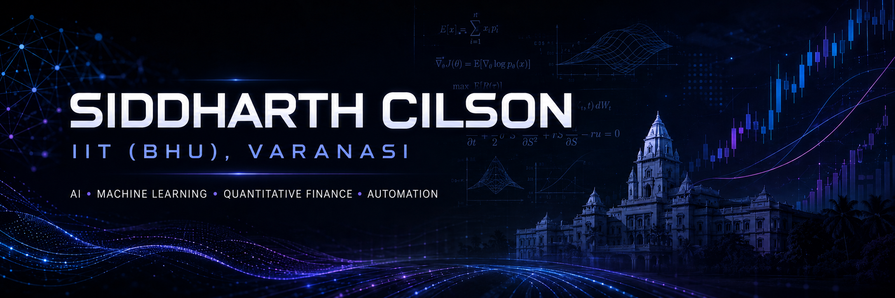
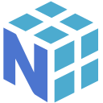

<!-- 
 
  
  
 -->
# Hi There 👋

 &nbsp;  

  

---

## 🎓 Background
Integrated B.Tech + M.Tech student @ **IIT (BHU), Varanasi** (2024-2029).

---

## 🚀 Current Focus

<table>
<tr>
<td>

- AI / LLM applications
- Quantitative & algorithmic trading
- ML research + automation

</td>
</tr>
</table>

---

## 🛠️ Tech Stack

### Languages & Core Tools

  
  
  
  
  
  
  
  
  
  

### AI / ML / Research

### Concepts I Work With

---

### 🌟 Featured Projects

<table>
<tr>
<th>Project</th>
<th>Stack</th>
</tr>

<tr>
<td><b>📊 Terminal X</b></td>
<td>Bloomberg-inspired market intelligence platform with data processing, quantitative analysis, APIs, and an interactive web interface.</td>
<td><code>Python</code> <code>Next.js</code> <code>FastAPI</code></td>
</tr>

<tr>
<td><b>🧠 Gola</b></td>
<td>CLI-first personal AI assistant focused on tool integration, structured workflows, and extensible agent functionality.</td>
<td><code>Python</code> <code>Gemini API</code></td>
</tr>

<tr>
<td><b>📈 Quant Trading & Backtester</b></td>
<td>Modular backtesting system for strategy evaluation, risk management, position sizing, transaction costs, and performance analysis.</td>
<td><code>Python</code> <code>pandas</code> <code>CCXT</code> <code>TA-Lib</code></td>
</tr>

<tr>
<td><b>🔬 PLGA Prediction</b></td>
<td>ML research pipeline for predicting nanoparticle properties with model comparison, cross-validation, hyperparameter optimization, and evaluation.</td>
<td><code>Python</code> <code>scikit-learn</code> <code>XGBoost</code> <code>CatBoost</code></td>
</tr>

</table>

---

  

---

